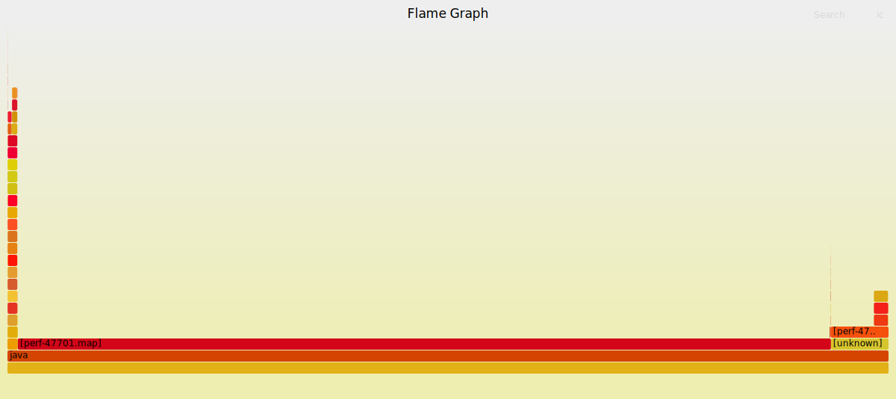
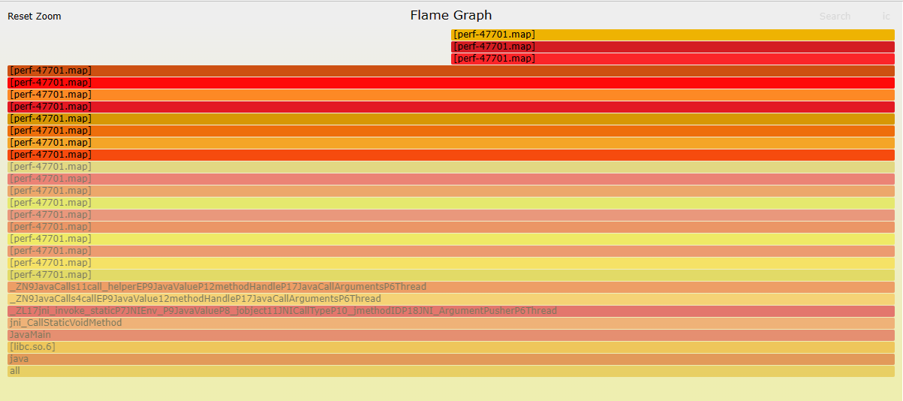
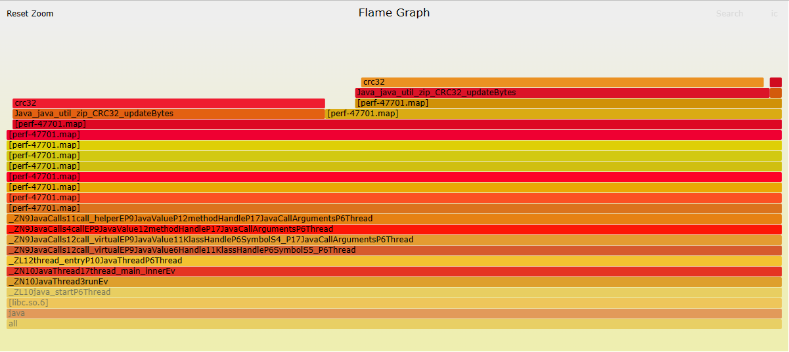
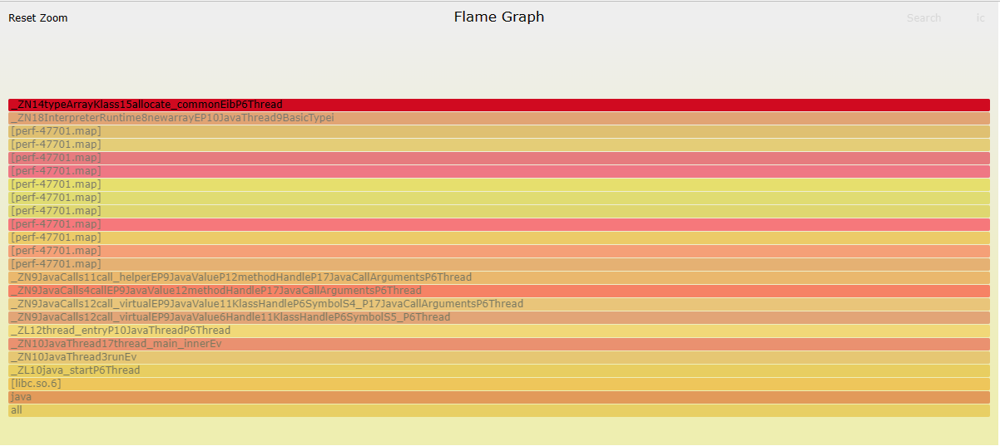
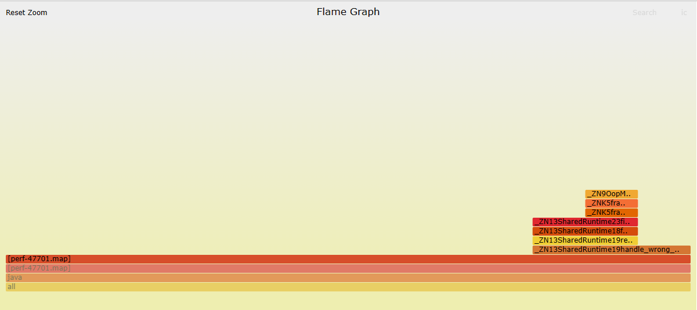
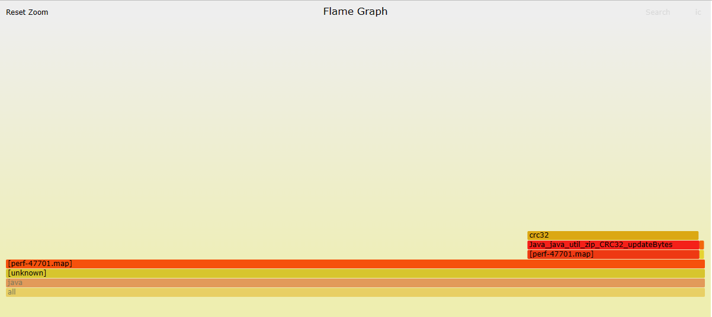
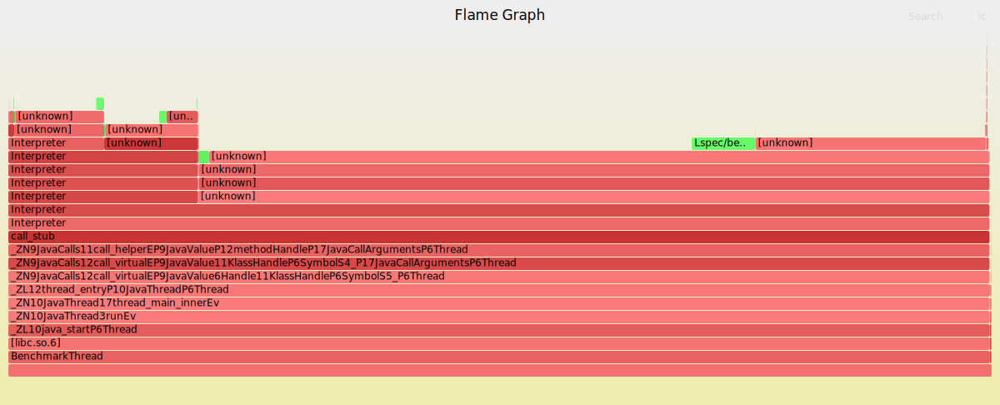
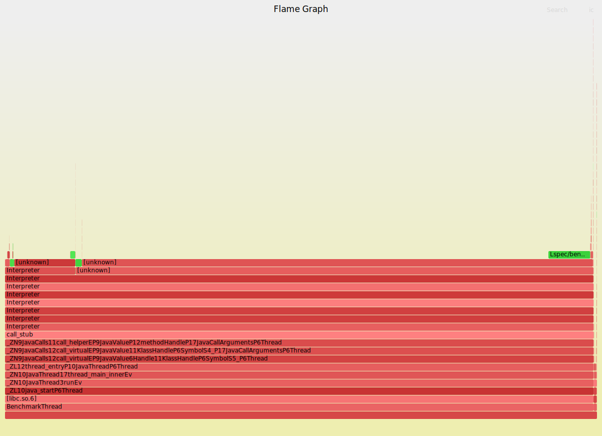

# SPECjvm2008学习记录

## 基本信息

SPECjvm2008是一个基准测试套件，包含几个现实场景的应用程序和一些专注于核心Java功能的基准测试。

下面是一些SPECjvm2008的关键基本信息：
- SPECjvm2008是由Java小组的核心设计团队开发的。AMD、BEA、HP、IBM、Intel、Sun都参与了该产品的设计、实施和测试阶段。
- SPECjvm2008计划在2006年发布，测试和其他延迟导致发布于2008年，因此命名为SPECjvm2008。
- SPECjvm2008测试JRE在典型Java应用程序上的性能，包括JAXP、Crypto库，不包括JavaEE内容（EJB、Servlet、JSP等）。
- SPECjvm2008还在执行JRE的上下文中测量操作系统和硬件的性能。
- SPECjvm2008除了测试吞吐量以外，还关注Java用户体验。
- SPECjvm2008的jar包中包含其全部源码。
- SPECjvm2008的源码也被公开在[GitHub](https://github.com/connorimes/SPECjvm2008)上。
- SPECjvm2008只能在单个JVM实例中工作，侧重于执行单个应用程序的JRE的性能。
- SPECjvm2008采用定时运行的运行模式，其中基准测试应尽可能在测量期内完成。
- SPECjvm2008可以反映硬件处理器和内存子系统的性能，但对文件I/O的依赖性低，并且不包括跨机器的网络I/O。
- SPECjvm2008的结果发布于[SPEC官方网站](https://www.spec.org/jvm2008/results/)。
- SPECjvm2008无法与任何其他基准进行比较。

## 配置环境

Linux环境无法用`wget`直接绕过Oracle的登录限制下载安装包，因此只能通过下载到本机后传输到Linux机器的方式实现下载。

例如，下面的命令获得的不是正确的tar.gz文件：
```shell
wget https://download.oracle.com/otn/java/jdk/7u80-b15/jdk-7u80-linux-x64.tar.gz
```

当执行解压命令时会报错：
```text
gzip: stdin: not in gzip format
tar: Child returned status 1
tar: Error is not recoverable: exiting now
```

### 安装配置Java8

解压JDK1.8压缩文件：
```shell
tar -zxvf jdk-8u371-linux-x64.tar.gz
```

配置Java8环境变量：
```shell
vim /etc/profile
```

向`/etc/profile`文件中添加下面的内容：
```shell
export JAVA_HOME=/home/<username>/jdk1.8.0_371
export CLASSPATH=$CLASSPATH:$JAVA_HOME/lib:$JAVA_HOME/jre/lib
export PATH=$JAVA_HOME/bin:$JAVA_HOME/jre/bin:$PATH:$SRILM/bin/i686-m64:$SRILM/bin
export LD_LIBRARY_PATH=$LD_LIBRARY_PATH:$JAVA_HOME
export PATH="$PATH:/tmp/bin"
```

修改后立即生效：
```shell
source /etc/profile
```

将安装的JDK加入java/javac候选清单：
```shell
sudo update-alternatives --install /usr/bin/java java /home/<username>/jdk1.8.0_371/bin/java 300
sudo update-alternatives --install /usr/bin/javac javac /home/<username>/jdk1.8.0_371/bin/javac 300
```

修改Ubuntu系统默认java/javac：
```shell
sudo update-alternatives --config java
sudo update-alternatives --config javac
```

### 安装配置Java7

选择合适的Java安装包：

解压JDK1.7压缩文件：
```shell
tar -zxvf jdk-7u80-linux-x64.tar.gz
```

配置Java7环境变量：
```shell
vim /etc/profile
```

向`/etc/profile`文件中添加下面的内容：
```shell
export JAVA_HOME=/home/<username>/jdk1.7.0_80
export JRE_HOME=$JAVA_HOME/jre
export CLASSPATH=.:$JAVA_HOME/lib/dt.jar:$JAVA_HOME/lib/tools.jar
export PATH=$PATH:$JAVA_HOME/bin:$JRE_HOME/bin
```

修改后立即生效：
```shell
source /etc/profile
```

将安装的JDK加入java/javac候选清单：
```shell
sudo update-alternatives --install /usr/bin/java java /home/<username>/jdk1.7.0_80/bin/java 300
sudo update-alternatives --install /usr/bin/javac javac /home/<username>/jdk1.7.0_80/bin/javac 300
```

修改Ubuntu系统默认java/javac：
```shell
sudo update-alternatives --config java
sudo update-alternatives --config javac
```

### 安装配置SPECjvm2008

下载SPECjvm2008：<br>
获取[SPECjvm2008_1_01_setup.jar](https://www.spec.org/jvm2008/)

WSL2环境安装SPECjvm2008会卡住，因为缺少依赖，可通过补全依赖解决：
```shell
sudo apt install x11-apps
sudo apt install x11-session-utils
sudo apt install dconf-editor
sudo apt install gedit
```

安装SPECjvm2008(GUI)：
```shell
java -jar ./SPECjvm2008_1_01_setup.jar
```

安装SPECjvm2008(Command Line)：
```shell
java -jar ./SPECjvm2008_1_01_setup.jar -i console
```

SPECjvm2008配置文件的路径：
- `SPECjvm2008/props/specjvm.properties`：负责整个套件的运行配置，例如指定需要运行的测试用例、测试迭代次数、每个用例跑完是否要GC等。
- `SPECjvm2008/props/specjvm.reporter.properties`：用于丰富报表的输出内容，显示一些无法通过自动检测得到的环境信息，例如内存型号、逻辑CPU个数等。

SPECjvm2008配置文件`specjvm.properties`常见修改：
```properties
specjvm.additional.properties.file=props/specjvm.reporter.properties // 指定报表配置文件路径
specjvm.benchmark.analyzer.names=HeapMemoryFreeAnalyzer HeapMemoryTotalAnalyzer // JVM堆分析器
specjvm.home.dir=/home/<user_name>/SPECjvm2008 // SPEC_HOME路径
specjvm.iteration.time=240s // 迭代时长
specjvm.startup.jvm_options=-Xms1024m -Xmx1024m -XX:+UseConcMarkSweepGC // JVM调优参数
```

## 系统环境

官方支持的组合：
- Java Virtual Machines:
    - Apache Harmony (5.0)
    - BEA JRockit (5.0 and 6.0)
    - HP JVM for HP-UX
    - IBM J9 (5.0 and 6.0)
    - Java for Sun OS X
    - Sun HotSpot (5.0 and 6.0)
- Operating Systems:
    - AIX
    - IBM i Operating System
    - HP-UX
    - Linux (multiple vendors and versions)
    - Solaris (9 and 10)
    - Z/OS
    - Windows (Server 2003, XP, Vista)
- Hardware Architectures:
    - Itanium
    - PA RISC
    - IBM Power Systems
    - SPARC (Niagra and Ultra SPARC, 32-bits and 64-bits)
    - X86 (AMD (Opteron), Intel (Netburst and Core2), 32-bits and 64-bits)
- Scalability:
    - Tested on as much as 8 sockets, 32 cores and 64 hardware threads.

SPECjvm2008基准测试运行的最低硬件条件：
- 内存：512MB
- 磁盘：256MB
- 为了使用尽可能少的资源，可以只运行一个基准测试线程，使用选项`-bt 1`。但是，这会影响测试结果。

查看WSL版本：
```shell
wsl -l -v
```

查看操作系统信息：
```shell
uname -a  # 查看操作系统完整信息
uname -s  # 查看操作系统内核名称
uname -n  # 查看网络节点上的主机名
uname -r  # 查看操作系统内核发行号
uname -v  # 查看操作系统内核版本
uname -m  # 查看主机的硬件架构名称
uname -p  # 查看处理器类型或"unknown"
uname -i  # 查看硬件平台或"unknown"
uname -o  # 查看操作系统名称
```

查看系统CPU信息：
```shell
cat /proc/cpuinfo |grep "physical id"|sort |uniq|wc -l  # 查看物理CPU个数
cat /proc/cpuinfo |grep "processor"|wc -l  # 查看逻辑cpu的个数
cat /proc/cpuinfo | grep "cpu cores" | uniq  # 查看CPU核数
cat /proc/cpuinfo  # 查看CPU型号
```

查看系统内存信息：
```shell
free -h
```

查看磁盘信息：
```shell
df -h
```

查看NVIDIA显卡配置：
```shell
nvidia-smi
```

## 工作负载

SPECjvm2008提供了以下工作负载：
- `startup.helloworld`：测试HelloWorld程序从运行开始到结束所需的时间。
- `startup.compiler.compiler`：测试普通Java编译所需要的时间。
- `startup.compiler.sunflow`：测试编译Sunflow图像渲染引擎所需要的时间。
- `startup.compress`：测试压缩程序，单次压缩所需的时间。
- `startup.crypto.aes`：测试AES/DES加密算法单次加密解密所需的时间。输入数据长度为100B、713KB。
- `startup.crypto.rsa`：测试RSA加密算法单次加密解密需要的时间。输入数据长度为100B、16KB。
- `startup.crypto.signverify`：测试单次使用MD5withRSA、SHA1withRSA、SHA1withDSA、SHA256withRSA来签名，识别所需要的时间。输入数据长度为1KB、65KB、1MB。
- `startup.mpegaudio`：测试单次mpeg音频解码所需的时间。
- `startup.scimark.fft`：测试单次快速傅立叶变换所需的时间。
- `startup.scimark.lu`：测试单次矩阵LU分解所需的时间。
- `startup.scimark.monte_carlo`：测试单次运行蒙特卡罗算法所需的时间。
- `startup.scimark.sor`：测试单次运行矩阵Jacobi逐次超松弛迭代法所需的时间。
- `startup.scimark.sparse`：测试单次稀疏矩阵乘积所需的时间。
- `startup.serial`：测试单次通过Socket传输Java序列化对象到对端反序列化完成所需的时间（基于JBoss Serialization Benchmark）。
- `startup.sunflow`：测试单次图片渲染处理所需的时间。
- `startup.xml.transform`：测试单次XML转换所需的时间，转换包括Dom、Sax、Stream方式。
- `startup.xml.validation`：测试单次XMLSchema校验所需的时间。
- `compiler.compiler`：在规定时间内，多线程迭代测试普通Java编译，得出ops/m。
- `compiler.sunflow`：在规定时间内，多线程迭代测试sunflow图像渲染，得出ops/m。
- `compress`：在规定时间内，多线程迭代测试压缩，得出ops/m。
- `crypto.aes`：在规定时间内，多线程迭代测试AES/DES加解密算法，得出ops/m。
- `crypto.rsa`：在规定时间内，多线程迭代测试RSA加解密算法，得出ops/m。
- `crypto.signverify`：在规定时间内，多线程迭代测试使用MD5withRSA、SHA1withRSA、SHA1withDSA、SHA256withRSA来签名，识别，得出ops/m。
- `derby`：在规定时间内，迭代测试数据库相关逻辑，包括数据库锁、BigDecimal计算等，最后得出ops/m。
- `mpegaudio`：在规定时间内，多线程迭代mpeg音频解码，得出ops/m。
- `scimark.fft.large`：在规定时间内，多线程迭代测试快速傅立叶变换，使用32M大数据集，最后得出ops/m。
- `scimark.lu.large`：在规定时间内，多线程迭代测试矩阵LU分解，使用32M大数据集，最后得出ops/m。
- `scimark.sor.large`：在规定时间内，多线程迭代测试矩阵Jacobi逐次超松弛迭代法，使用32M大数据集，最后得出ops/m。
- `scimark.sparse.large`：在规定时间内，多线程迭代测试稀疏矩阵乘积，使用32M大数据集，最后得出ops/m。
- `scimark.fft.small`：在规定时间内，多线程迭代测试快速傅立叶变换，使用512K小数据集，最后得出ops/m。
- `scimark.lu.small`：在规定时间内，多线程迭代测试矩阵LU分解，使用512KB小数据集，最后得出ops/m。
- `scimark.sor.small`：在规定时间内，多线程迭代测试矩阵Jacobi逐次超松弛迭代法，使用512KB小数据集，最后得出ops/m。
- `scimark.sparse.small`：在规定时间内，多线程迭代测试稀疏矩阵乘积，使用512KB小数据集，最后得出ops/m。
- `scimark.monte_carlo`：在规定时间内，多线程迭代测试蒙特卡罗算法，得出ops/m。
- `serial`：在规定时间内，多线程迭代测试通过Socket传输Java序列化对象到对端反序列化（基于JBoss Serialization Benchmark），得出ops/m。
- `sunflow`：在规定时间内，利用Sunflow多线程迭代测试图片渲染，得出ops/m。
- `xml.transform`：在规定时间内，多线程迭代测试XML转换，得出ops/m。
- `xml.validation`：在规定时间内，多线程迭代测试XMLSchema验证，得出ops/m。

ops/m是性能测试中的一个常见指标，表示每分钟完成的操作数（Operations Per Minute）。它用于衡量系统或应用程序在单位时间内能够处理的操作数量。较高的ops/m值表示系统具有更高的吞吐量和处理能力，能够在单位时间内处理更多的请求或操作。<br>
在性能测试中，通常会模拟真实场景下的负载并执行一系列操作，如请求处理、数据读写、计算等。通过测量在一分钟内完成的操作数，可以评估系统的处理能力和性能。

## 版本约束

Java5可能遇到如下问题：
- BEA JRockit、HP JVM、Sun Hotspot等JVM产品依赖的Apache Xerces库存在竞争，可能导致`xml.transform`测试失败。可以使用`java -jar SPECjvm2008.jar -Dspecjvm.benchmark.threads.xml.tranform=1`命令采用一个基准测试线程来避免竞争。<br>
- Unix或Linux操作系统上，Sun Hotspot依赖的JAXP库解析目录字符串的方式存在问题，可能导致`xml.validation`测试出现`java.lang.NullPointerException`。可以用`java -jar SPECjvm2008.jar -xd `\`pwd\``/resources/xml.validation`命令指定绝对路径来解决问题。

Java6可能是比较合适的版本。

Java8及更高版本无法通过以下工作负载的测试：
- `startup.compiler.compiler`
- `startup.compiler.sunflow`
- `compiler.compiler`
- `compiler.sunflow`

Java9及更高版本无法通过以下工作负载的测试：
- `startup.xml.transform`
- `startup.xml.validation`
- `xml.transform`
- `xml.validation`

Java10及更高版本可能无法运行SPECjvm2008。

## 测试周期

SPECjvm2008提供了21项测试基准：
- `compiler.compiler`
- `compiler.sunflow`
- `compress`
- `crypto`
- `crypto.aes`
- `crypto.rsa`
- `crypto.signverify`
- `derby`
- `helloworld`
- `mpegaudio`
- `scimark.fft`
- `scimark.lu`
- `scimark.monte_carlo`
- `scimark.sor`
- `scimark.sparse`
- `serial`
- `startup`
- `startup.helloworld`
- `sunflow`
- `xml.transform`
- `xml.validation`

SPECjvm2008的一项基准测试需要2分钟的预热时间和4分钟的测量运行时间。在此期间，多项不被中断的操作将被执行，直到所有线程都完成了在测量间隔内开始的操作才会终止。实际的测量周期会长于预估的4分钟，某些情况下时间甚至会明显增加。<br>
因此，总的执行时间至少为$21×6=126$分钟，即大约2小时。

为了保证公平和准确性、确保在测量期内开始的每个操作都会对测量结果产生影响，SPECjvm2008的操作会继续执行直到所有在测量期内开始的操作都完成（即使测量期已经结束），但只有在测量期内执行的部分会被计算在内。<br>如果有一部分操作在测量期内开始但没有在期内完成，那么它对测量结果的贡献程度将取决于它在测量期内执行的时间比例，这个数值位于0到1之间。为了确保在测量期外执行操作不会有任何优势，测试框架会继续执行线程，直到所有在测量期内开始的操作都完成为止。这样可以确保测量结果的准确性，并使不同操作在相同条件下进行比较。

SPECjvm2008关注秒为单位的操作时长。通过连续运行多个操作（很可能是短时间的操作）并持续一段时间，会出现一些典型的JVM问题，例如内存系统的负载（分配、垃圾回收等），这是Java性能的关键。当连续运行基准测试操作4分钟时，JVM需要处理这些"副作用"。

## 启动参数

运行示例：
```shell
java -jar SPECjvm2008.jar --help
```

| 短参数 | 长参数 | 值类型 | 属性名称 | 详细描述 |
|:----:|:----:|:----:|:----:|:----:|
| -h | --help |   |   | 显示帮助信息 |
|   | --version |   |   | 输出SPECjvm2008版本并退出 |
| -sv | --showversion |   |   | 输出SPECjvm2008版本并继续 |
|   | --base |   |   | 运行SPECjvm2008的基本吞吐量测量（默认参数） |
|   | --peak |   |   | 运行SPECjvm2008的峰值吞吐量测量 |
|   | --lagom |   |   | 运行Lagom基准套件（采用固定的工作负载） |
| -pf | --propfile | string | specjvm.propfile | 引入属性配置文件 |
| -i | --iterations | int | specjvm.miniter, specjvm.maxniter | 指定运行的迭代次数（`inf`代表无限） |
| -mi | --miniter | int | specjvm.miniter | 设置最小迭代次数 |
| -ma | --maxiter | int | specjvm.maxniter | 设置最大迭代次数 |
| -it | --iterationtime | time | specjvm.iteration.time | 设置一次迭代持续的时间，例如`4m`，可选单位有`ms`、`s`、`m`、`h`<br>如果迭代时间太短，会根据预热结果调整为期望至少完成5次操作 |
| -fit | --forceIterationIime | time | specjvm.iteration.time, specjvm.iteration.time.forced | 强制设置迭代时间，但不会根据warmup结果调整时间 |
| -ja | --jvmArgs | string | specjvm.startup.jvm_options | 启动子测试的JVM选项 |
| -jl | --jvmLauncher | path | specjvm.benchmark.startup.launcher | 启动子测试的JVM启动器 |
| -wt | --warmuptime | time | specjvm.benchmark.warmup.time | 设置预热时间，例如`2m`，可选单位有`ms`、`s`、`m`、`h` |
| -ops | --operations | int | specjvm.fixed.operations, specjvm.run.type | 设置每次迭代将包含多少个操作，这将明确一个固定的工作负载，迭代时间将被忽略 |
| -bt | --benchmarkThreads | int | specjvm.benchmark.threads | 设置需要使用的基准线程数 |
| -r | --reporter | raw file name |   | 从给定的文件中引入reporter，基准测试将不会运行 |
| -v | --verbose |   | specjvm.print.verbose, specjvm.print.progress | 输出详细信息（仅限测试框架） |
| -pja | --parseJvmArgs |   |   | 从命令行解析JVM参数信息 |
| -coe | --continueOnError |   | specjvm.continue.on.error | 允许测试失败时继续运行套件 |
| -ict | --ignoreCheckTest |   | specjvm.run.initial.check | 不运行检查基准 |
| -ikv | --ignoreKitValidation |   | specjvm.run.checksum.validation | 不运行校验和验证基准 |
| -crf | --createRawFile | boolean | specjvm.create.xml.report | 设置是否生成原始文件 |
| -ctf | --createTextFile | boolean | specjvm.create.txt.report | 设置是否生成文本报告，如果raw禁用则txt也禁用 |
| -chf | --createHtmlFile | boolean | specjvm.create.html.report | 设置是否生成html报告，如果raw禁用则html也禁用 |
| -xd | --xmlDir | path | specjvm.benchmark.xml.validation.input.dir | 设置XML输入文件路径 |
|   | <benchmark(s)> |   | specjvm.benchmarks | 注明要运行的全部基准测试的名称，默认运行所有基准 |

## 启动测试

测试环境：
- Machine's Architecture : x86_64
- Operating System : GNU/Linux
- OS Kernel Release Number : 5.11.0-37-generic
- OS Kernel Version : #41~20.04.2-Ubuntu SMP Fri Sep 24 09:06:38 UTC 2021
- CPU Model : Intel(R) Xeon(R) Gold 6226 CPU @ 2.70GHzCPU
- CPU Cores : 12
- Main Memory Size : 125GB
- Graphics Card Version : NVIDIA Corporation TU102 [GeForce RTX 2080 Ti]
- JDK Version : jdk-8u371-linux-x64
- JRE Version : 1.8.0_371-b11

测试模式：
- `--base`：总基础吞吐量测量，从完全兼容的基础运行中获得的总体吞吐量结果，不允许做任何JVM参数调整。
- `--peak`：总峰值吞吐量测量，从完全兼容的峰值运行中获得的总吞吐量结果，可以添加JVM调优参数。

跳过签名检查：`-ikv`

测试命令：
```shell
java -Djava.awt.headless=true -jar SPECjvm2008.jar -i console -ikv startup.helloworld  startup.compress startup.crypto.aes startup.crypto.rsa startup.crypto.signverify startup.mpegaudio startup.scimark.fft startup.scimark.lu startup.scimark.monte_carlo startup.scimark.sor startup.scimark.sparse startup.serial startup.sunflow startup.xml.validation compress crypto.aes crypto.rsa crypto.signverify derby mpegaudio scimark.fft.large scimark.lu.large scimark.sor.large scimark.sparse.large scimark.fft.small scimark.lu.small scimark.sor.small scimark.sparse.small scimark.monte_carlo serial sunflow xml.validation
```

测试时间：略小于2h。（跳过了4个workflow）

测试结果：<br>
测试完成后，前往`SPECjvm2008/results/`目录下查看测试结果HTML文档。<br>
Noncompliant composite result : 969.38 ops/m

此系统环境下，内核版本是Ubuntu20.04.2，内核发行号是5.11.0-37-generic，硬件指令集是x86_64，能查找到的linux-tools-5.11.0-37-generic软件包只支持amd64，只不过amd64和x86_64是兼容的。问题会具体表现为：
- 启动`perf`时提示：
    ```text
    WARNING: perf not found for kernel 5.11.0-37
      You may need to install the following packages for this specific kernel:
        linux-tools-5.11.0-37-generic
        linux-cloud-tools-5.11.0-37-generic
      You may also want to install one of the following packages to keep up to date:
        linux-tools-generic
        linux-cloud-tools-generic
    ```
- 以`sudo apt install linux-tools-5.11.0-37-generic`安装`linux-tools-5.11.0-37-generic`时报错：
    ```text
    Reading package lists... Done
    Building dependency tree... Done
    Reading state information... Done
    E: Unable to locate package linux-tools-5.11.0-37-generic
    E: Couldn't find any package by glob 'linux-tools-5.11.0-37-generic'
    ```

## 异常解决

推荐阅读：[SPECjvm2008已知问题解决方案](https://www.spec.org/jvm2008/docs/KnownIssues.html)

# perf学习记录

## 基本信息

### perf

perf是一个性能分析工具，用于在Linux系统上进行系统性能分析和调优。它可以帮助开发人员和系统管理员深入了解系统的性能瓶颈和应用程序的性能特征，并根据分析结果进行优化和调优。perf是一个强大的工具，被广泛用于开发、调试和优化各种类型的应用程序。

perf工具可以提供多种性能分析功能，包括：
- CPU性能分析：可以使用perf来收集和分析CPU的使用情况，包括指令执行、缓存命中率、分支预测等信息，帮助发现CPU瓶颈和优化机会。
- 内存性能分析：可以使用perf来跟踪内存访问模式、内存分配和释放、页面错误等情况，以帮助识别内存相关的性能问题。
- I/O性能分析：perf可以用于分析磁盘、网络和其他I/O设备的使用情况，以了解I/O操作的性能瓶颈和优化空间。
- 系统调用分析：perf可以监视和分析应用程序的系统调用行为，包括调用次数、耗时等信息，帮助优化系统调用的性能。
- 火焰图生成：perf可以生成火焰图，用于可视化函数调用关系和函数执行时间，在性能分析中非常有用。

Linux[开源代码](https://github.com/torvalds/linux/tree/master/tools/perf)中有perf的实现。


perf命令格式：
```shell
perf [--version] [--help] [OPTIONS] COMMAND [ARGS]
```

COMMAND：
- `annotate`：读取perf.data文件，并显示带注释的代码。
- `archive`：使用perf.data文件中找到的构建ID创建包含对象文件的存档。
- `bench`：用于基准测试套件的通用框架。
- `buildid-cache`：管理构建ID缓存。
- `buildid-list`：列出perf.data文件中的构建ID。
- `c2c`：共享数据C2C/HITM分析器。
- `config`：获取并设置配置文件中的变量。
- `daemon`：在后台运行记录会话。
- `data`：与数据文件相关的处理。
- `diff`：读取perf.data文件并显示差分配置文件。
- `evlist`：列出perf.data文件中的事件名称。
- `ftrace`：内核ftrace功能的简单包装器。
- `inject`：用于增加事件流中的附加信息的过滤器。
- `iostat`：显示I/O性能指标。
- `kallsyms`：搜索运行中内核的符号。
- `kvm`：跟踪/测量KVM客户操作系统。
- `list`：列出所有符号事件类型。
- `mem`：分析内存访问。
- `record`：运行命令并将其配置文件记录到perf.data中。
- `report`：读取perf.data文件并显示配置文件。
- `script`：读取perf.data文件并显示跟踪输出。
- `stat`：运行命令并收集性能计数器统计信息。
- `test`：运行完整性测试。
- `top`：系统性能分析工具。
- `version`：显示perf二进制文件的版本。
- `probe`：定义新的动态跟踪点。

### 堆栈

堆栈用作局部程序变量和程序执行状态的临时存储区。每次输入一个新函数时，处理器都会分配一个新的堆栈部分来保存该函数所需的信息。这部分称为函数的堆栈帧。它包含函数的临时变量和几个关键信息，包括保存的处理器寄存器和父例程的返回地址。处理器中的一个寄存器称为帧指针(FP)，它始终指向当前正在执行的函数的堆栈帧。当一个子程序被调用时，旧的帧指针被保存在堆栈中，一个新的堆栈帧被创建，并更新帧指针。因此，在任何时刻，整个函数调用历史都存在于堆栈中，并且可以通过“遍历”存储在堆栈中的帧指针链来确定。

### 火焰图

提出火焰图的目的是展示函数调用关系和其在整个程序执行期间的耗时。技术专家通过分析火焰图中不同函数之间的调用关系和函数自身的耗时，可以了解应用程序在不同代码路径上的性能瓶颈，并进行性能优化。

火焰图具有以下特点：
- 栈跟踪被表示为一列方框，每个方框代表一个函数（一个栈帧）。
- 纵轴显示栈的深度，从根部位于底部到叶部位于顶部的顺序排列。顶部方框显示在收集栈跟踪时处于CPU上的函数，其下方是它的祖先函数。一个函数下面的函数是它的父函数。
- 横轴跨越栈跟踪的收集。它不显示时间的流逝，所以从左到右的顺序没有特殊意义。栈跟踪的从左到右的顺序按照函数名称的字母顺序，从每个栈的根部到叶部排列。这样可以最大程度地合并方框：当水平相邻的函数方框相同时，它们会被合并。
- 每个函数方框的宽度显示了该函数在栈跟踪中出现的频率，或者作为栈跟踪祖先的一部分。具有较宽方框的函数在栈跟踪中出现的频率比具有较窄方框的函数高，与它们的宽度成比例。
- 如果方框足够宽，它会显示完整的函数名称。如果不够宽，会显示截断的函数名称带有省略号，或者不显示任何内容。
- 每个方框的背景颜色并不重要，是随机选择的温暖色调。这种随机性有助于眼睛区分方框，特别是对于相邻的细长的"塔"。后面会讨论其他的颜色方案。
- 可视化的分析范围可以跨越单个线程、多个线程、多个应用程序或多个主机。如果需要，可以生成单独的火焰图，特别是用于研究单个线程。
- 栈跟踪可以从不同的分析器目标收集，方框的宽度可以反映除采样计数以外的其他度量指标。例如，分析器（或追踪器）可以测量线程的阻塞时间以及其栈跟踪。这可以被可视化为火焰图，其中横轴跨越总的阻塞时间，火焰图显示阻塞代码路径。

火焰图既是一种静态的可视化工具，也是一种动态的可视化工具。
- 作为一种静态可视化工具，火焰图可以保存为图像，包含在印刷品中，仍然能传达"全局视图"，因为只有最常见的帧才有足够宽度来显示标签。整个分析器的输出被一次性可视化，最终用户可以直观地导航到感兴趣的区域，火焰图中的形状和位置成为观测软件执行的可视化地图。
- 作为一种动态可视化工具，火焰图允许交互式功能来帮助导航和理解，包括：
    - 鼠标悬停显示状态栏中的额外帧详细信息（完整的函数名称、配置文件中存在的样本数以及配置文件中这些样本的相应百分比）。
    - 鼠标单击水平缩放可视化工具，显示之前省略的函数名称。
    - 搜索匹配并突出显示给定术语，并显示包含搜索术语的栈的"累积百分比"。

一些操作系统分析工具内置了对火焰图的支持：
- Linux：perf
- Windows：WPA、PerfView

火焰图也可以从任何包含堆栈跟踪的分析数据生成，包括来自以下分析工具：
- Linux：perf、eBPF、SystemTap、ktap
- FreeBSD：DTrace
- MacOSX：Instruments
- Windows：Xperf.exe

当perf生成火焰图时，它会尝试解析二进制文件中的符号信息，以便将程序的地址映射到函数名或符号名称。

### perf-map-agent

Linux性能工具期望在`/tmp/perf-<pid>.map`中提供未知内存区域中执行的代码的符号。这使得能够为动态生成代码的运行时环境提供动态符号映射，以供perf工具套件使用。

perf-map-agent一款[开源的](https://github.com/jvm-profiling-tools/perf-map-agent)、致力于为Java应用程序生成这样的映射文件的代理程序。perf-map-agent由一个用C编写的Java代理程序和一个小型的Java引导应用程序组成，该引导应用程序将代理程序附加到正在运行的Java进程上。

当perf-map-agent代理程序附加到Java进程上时，它从JVM获取JVM运行时生成的代码块，包括JIT编译的方法，还包括动态生成的基础设施部分，例如动态创建的解释器、适配器以及用于虚拟调度的跳转表。perf-map-agent代理程序创建了一个`/tmp/perf-<pid>.map`文件，每个代码块映射一个内存位置和一个代码块名称。

perf-map-agent的bin目录包含一组用于结合常见的perf/dtrace操作和创建映射文件的Shell脚本：
- `create-java-perf-map.sh <pid> <options*>`：接受一个PID和选项。它知道在bin目录相对于哪里找到库文件。
- `perf-java-top <pid> <perf-top-options>`：接受一个PID和其他要传递给`perf top`的选项。使用代理程序创建一个新的`/tmp/perf-<pid>.map`文件，然后使用给定的选项调用`perf top`。
- `perf-java-record-stack <pid> <perf-record-options>`：接受一个PID和其他要传递给`perf record`的选项。运行`perf record -g -p <pid> <perf-record-options>`来收集包括堆栈跟踪在内的性能数据。然后使用代理程序创建一个新的`/tmp/perf-<pid>.map`文件。
- `perf-java-report-stack <pid> <perf-record-options>`：首先调用perf-java-record-stack <pid> <perf-record-options>，然后运行`perf report`来直接分析捕获的数据。在脚本退出后，可以再次使用`perf report -i /tmp/perf-<pid>.data`以及任何选项来进一步分析之前运行的数据。
- `perf-java-flames <pid> <perf-record-options>`：使用`perf-java-record-stack`收集数据，然后使用brendangregg的FlameGraph工具创建可视化效果。要获得跨多个JIT编译方法的有意义的堆栈跟踪，需要使用`-XX:+PreserveFramePointer`（从JDK8-update-60-build-19开始可用）。
- `create-links-in <targetdir>`：将符号链接安装到上述脚本中的<targetdir>目录中。
- `dtrace-java-record-stack <pid>`：接受一个PID。运行dtrace来收集包括堆栈跟踪在内的性能数据。然后使用代理程序创建一个新的/tmp/perf-<pid>.map文件。
- `dtrace-java-flames <pid>`：使用dtrace-java-record-stack收集数据，然后使用@brendangregg的FlameGraph工具创建可视化效果。要获得跨多个JIT编译方法的有意义的堆栈跟踪，需要使用-XX:+PreserveFramePointer（从JDK8更新60构建19开始可用），如ag netflix博客文章中所述。

## 配置环境

### 安装配置perf

安装perf(Ubuntu环境)：
```shell
sudo apt update
sudo apt upgrade
sudo apt-get install linux-tools-common linux-tools-generic linux-cloud-tools-generic linux-tools-`uname -r`
```

安装perf(WSL-Ubuntu环境)：
```shell
sudo apt update
sudo apt upgrade
sudo apt-get install linux-tools-common linux-tools-generic linux-cloud-tools-generic linux-tools-`uname -r`
sudo apt install build-essential flex bison libssl-dev libelf-dev
git clone --depth=1 https://github.com/microsoft/WSL2-Linux-Kernel.git
cd WSL2-Linux-Kernel/tools/perf
make
cp perf /usr/bin
```

查看perf版本：
```shell
perf version
```

### 安装配置FlameGraph

下载[FlameGraph](https://github.com/brendangregg/FlameGraph)源码：
```shell
git clone https://github.com/brendangregg/FlameGraph.git
```

配置FlameGraph环境变量：
```shell
vim /etc/profile
```

向`/etc/profile`文件中添加下面的内容：
```shell
export FLAMEGRAPH_DIR=/home/<username>/FlameGraph
```

修改后立即生效：
```shell
source /etc/profile
```

### 安装perf-map-agent

下载[perf-map-agent](https://github.com/jvm-profiling-tools/perf-map-agent)源码：
```shell
git clone "https://github.com/jvm-profiling-tools/perf-map-agent"
```

编译与链接：
```shell
cd perf-map-agent
cmake .
make
./bin/create-links-in <target_dir>
```

## 监测性能与生成火焰图

### 全局性能监测

监测全局性能(输入`Ctrl+C`终止监测，输出数据是`perf.data`)：
```shell
perf record -g
```

查看perf记录：
```shell
perf report
```

将perf数据转化为txt格式：
```shell
perf script > perf.data.txt
```

根据`perf.data.txt`生成火焰图：
```shell
./FlameGraph/stackcollapse-perf.pl perf.data.txt | ./FlameGraph/flamegraph.pl > flamegraph.svg
```

也可以这样做：
```shell
perf record -F 99 -a -g -- sleep 60
perf script -i perf.data | ./FlameGraph/stackcollapse-perf.pl | ./FlameGraph/flamegraph.pl > flamegraph.svg
```

### SPECjvm2008性能监测

Machine's Architecture : x86_64
Operating System : GNU/Linux
OS Kernel Release Number : 5.15.90.1-microsoft-standard-WSL2
OS Kernel Version : #1 SMP Fri Jan 27 02:56:13 UTC 2023
CPU Model : Intel(R) Core(TM) i5-8300H CPU @ 2.30GHz
CPU Cores : 4
Main Memory Size : 7.7GB
Graphics Card Version : NULL
JDK Version : jdk-8u371-linux-x64
JRE Version : 1.8.0_371-b11

编写[`wait_until_run_perf.sh`](./src/wait_until_run_perf.sh)脚本实现以下任务目标：在忙等待的状态下获取特定命令的进程pid，并在进程执行期间使用perf命令对该进程进行监测，最后在进程执行结束后结束程序。

启动compress基准测试：
```shell
java -Djava.awt.headless=true -jar SPECjvm2008.jar -i console -ikv compress
```

监测指定进程的性能(输入`Ctrl+C`终止监测，输出数据是`perf.data`)：
```shell
perf record -p <pid> -g
```

将perf数据转化为txt格式：
```shell
perf script > perf.data.txt
```

根据`perf.data.txt`生成火焰图：
```shell
./FlameGraph/stackcollapse-perf.pl perf.data.txt | ./FlameGraph/flamegraph.pl > flamegraph-compress.svg
```

火焰图效果展示：<br>







编写脚本[run_perf_with_map.sh](./src/run_perf_with_map.sh)用perf-map-agent直接生成火焰图，将其放置于SPECjvm2008根路径下，将安装时的`<target_dir>`设置为SPECjvm2008根路径，然后：
```shell
chmod +x ./run_perf_with_map.sh
./run_perf_with_map.sh
```

火焰图效果展示：<br>


编写脚本[run_perf_map_agent.sh](./src/run_perf_map_agent.sh)，在忙等待的状态下获取特定命令的进程pid，并在进程执行期间使用perf-map-agent对该进程进行监测，在进程执行结束后生成火焰图。将脚本放置于SPECjvm2008根路径下，将安装时的`<target_dir>`设置为SPECjvm2008根路径，然后：
```shell
chmod +x ./run_perf_map_agent.sh
./run_perf_map_agent.sh
```

火焰图效果展示：<br>


# 参考资料

## 基础教程

1. [菜鸟教程: Linux apt命令](https://www.runoob.com/linux/linux-comm-apt.html)
2. [菜鸟教程: Docker容器使用](https://www.runoob.com/docker/docker-container-usage.html)
3. [Git-SCM: Git Document](https://git-scm.com/doc)

## 安装配置

1. [简书: Linux安装.bin文件](https://www.jianshu.com/p/a812043edec4)
2. [Gist: Install perf inside docker container](https://gist.github.com/nidhi-ag/0eed632509a79ebc75218a8485a1ebe1)
3. [StackOverflow: Is there any method to run perf under WSL?](https://stackoverflow.com/questions/60237123/is-there-any-method-to-run-perf-under-wsl)
4. [StackExchange: How to install "perf" monitoring tool?](https://askubuntu.com/questions/50145/how-to-install-perf-monitoring-tool)
5. [GitHub: Stupid WARNING messages prevent me from running valid commands](https://github.com/microsoft/WSL/issues/9917)

## SPECjvm2008学习资料

1. [简书: SPECjvm2008堵塞调试](https://www.jianshu.com/p/9924b206bdfe)

## perf学习资料

1. [Wiki: Linux kernel profiling with perf](https://perf.wiki.kernel.org/index.php/Tutorial)
2. [brendangregg的博客: Linux Performance](https://www.brendangregg.com/linuxperf.html)
3. [brendangregg的博客: perf Examples](https://www.brendangregg.com/perf.html)=
4. [chinggg的博客: 在Docker中运行Linux性能分析工具perf](https://chinggg.github.io/post/docker-perf/)
5. [GitHub: jvm-profiling-tools/perf-map-agent](https://github.com/jvm-profiling-tools/perf-map-agent)


## FlameGraph学习资料

1. [The Flame Graph: This visualization of software execution is a new necessity for performance profiling and debugging.](https://dl.acm.org/doi/10.1145/2927299.2927301)
2. [GitHub: brendangregg/FlameGraph](https://github.com/brendangregg/FlameGraph)
3. [brendangregg的博客: Flame Graphs](https://www.brendangregg.com/flamegraphs.html)
