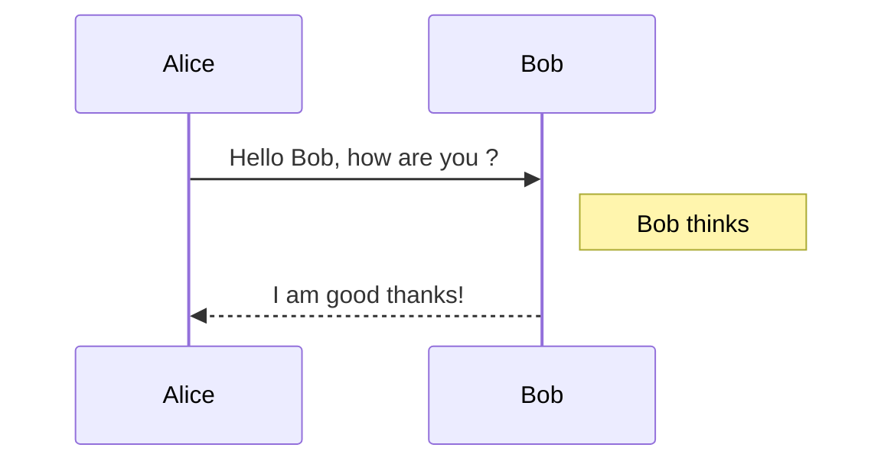

# Markdown

> Markdown 是一种可以使用普通文本编辑器编写的标记语言，通过简单的标记语法，它可以使普通文本内容具有一定的格式。

# 目录

CSDN写法(非Markdown标准语法，其他Markdown编辑器不解析)：
```
@[TOC]
```
或者
```
@[TOC](文章目录标题)
```

GitHub写法(自定义)：
```
- [分级标题](#分级标题)
- [分隔线](#分隔线)
- [超链接](#超链接)
  - [行内式](#行内式)
  - [参考式](#参考式)
  - [自动链接](#自动链接)
- [区块引用](#区块引用)
  - [引用的多层嵌套](#引用的多层嵌套)
  - [引用其它要素](#引用其它要素)
- [锚点](#锚点)
- [强调](#强调)
  - [斜体](#斜体)
  - [粗体](#粗体)
  - [删除线](#删除线)
- [列表](#列表)
  - [无序列表](#无序列表)
  - [有序列表](#有序列表)
  - [包含引用的列表](#包含引用的列表)
- [插入图片](#插入图片)
  - [图片行内式](#图片行内式)
  - [图片参考式](#图片参考式)
- [表格](#表格)
- [代码](#代码)
  - [代码行内式](#代码行内式)
  - [缩进式多行代码](#缩进式多行代码)
  - [用六个`包裹多行代码](#用六个--包裹多行代码)
  - [HTML 原始码](#html-原始码)
- [内容目录](#内容目录)
- [注脚](#注脚)
- [LaTeX 公式](#latex-公式)
  - [$ 表示行内公式](#-表示行内公式)
  - [$$ 表示整行公式](#-表示整行公式)
- [流程图](#流程图)
- [时序图](#时序图)
- [待办事宜列表](#待办事宜列表)
```

# 分级标题

方法1：

```
这是一个一级标题
============================

这是一个二级标题
--------------------------------------------------
```

> 这是一个一级标题
> ============================
> 这是一个二级标题
> --------------------------------------------------


方法2：

```
# 一级标题
## 二级标题
### 三级标题
#### 四级标题
##### 五级标题
###### 六级标题
```

> # 一级标题
> ## 二级标题
> ### 三级标题
> #### 四级标题
> ##### 五级标题
> ###### 六级标题

# 分隔线

分割线可以用一行内三个以上的星号、减号、底线来标注，此行内不能有其他内容。你也可以在星号或是减号中间插入空格。下面每种写法都可以建立分隔线：

```
* * *

***

*****

- - -

---------------------------------------
```

> * * *
> - - -

## 超链接

Markdown支持两种形式的链接语法：行内式和参考式。

### 行内式

`[]`里写链接文字，`()`里写链接地址，`()`中的 `""`中可以为链接指定title属性，title属性可加可不加。title属性的效果是鼠标悬停在链接上会出现指定的title文字。`[链接文字](链接地址 "链接标题")`这样的形式。链接地址与链接标题前有一个空格。

```markdown
[Google](https://www.google.com)
[Google](https://www.google.com "google")
```

> [Google](https://www.google.com)
> <br />
> 
> [Google](https://www.google.com "google")

### 参考式

参考式超链接一般用在学术论文上面，或者另一种情况，如果某一个链接在文章中多处使用，那么使用引用的方式创建链接将非常好，它可以让你对链接进行统一的管理。

参考式链接分为两部分，文中的写法 `[链接文字][链接标记]`，在文本的任意位置添加 `[链接标记]:链接地址 "链接标题"`，链接地址与链接标题前有一个空格。

```markdown
全球最大的搜索引擎网站是[Google][1]。

[1]:http://www.google.com "Google"
```

> 全球最大的搜索引擎网站是 [Google][1]。
> <br />
>
> [1]:http://www.google.com "Google"

### 自动链接

Markdown支持以比较简短的自动链接形式来处理网址和电子邮件信箱, 只要是用`<>`包起来，Markdown就会自动把它转成链接。一般网址的链接文字就和链接地址一样，例如：

```markdown
<https://google.com>

<hahaha@gmail.com>
```

> <https://google.com>
> <br />
>
> <hahaha@gmail.com>

## 区块引用

区块引用需要在被引用的文本前加上`>`符号。

```markdown
> 这是一个区块引用实例，

> Markdown
```

> 这是一个区块引用实例，

> Markdown

Markdown也允许你偷懒只在整个段落的第一行最前面加上`>`:

```markdown
> 练得身形似鹤形，
千株松下两函经。
我来问道无余说，
云在青天水在瓶。

> 飘飘乎如遗世独立，
羽化而登仙。
```

> 练得身形似鹤形，
千株松下两函经。
我来问道无余说，
云在青天水在瓶。

> 飘飘乎如遗世独立，
羽化而登仙。

### 引用的多层嵌套

区块引用可以嵌套，只要根据层次加上不同数量的`>`即可：

```markdown
>>> 飘飘乎如遗世独立，羽化而登仙。 - 苏轼

>> 我来问道无余说，云在青天水在瓶。 - 李翱

> 仿佛兮若轻云之蔽月，飘飘兮若流风之回雪。 - 曹植
```

>>> 飘飘乎如遗世独立，羽化而登仙。 - 苏轼

>> 我来问道无余说，云在青天水在瓶。 - 李翱

> 仿佛兮若轻云之蔽月，飘飘兮若流风之回雪。 - 曹植

### 引用其它要素

引用的区块内也可以使用其他的Markdown语法，包括标题、列表、代码区块等:

```markdown
> - 仿佛兮若轻云之蔽月，飘飘兮若流风之回雪。
>
> - 飘飘乎如遗世独立，羽化而登仙。
>
> - 下面是一段代码：
>     ```java
>     public class Main {
>         public static void main(String[] args) {
>             System.out.println("Hello, World!");
>         }
>     }
>     ```
```

> - 仿佛兮若轻云之蔽月，飘飘兮若流风之回雪。
>
> - 飘飘乎如遗世独立，羽化而登仙。
>
> - 下面是一段代码：
>     ```java
>     public class Main {
>         public static void main(String[] args) {
>             System.out.println("Hello, World!");
>         }
>     }
>     ```

## 锚点

网页中, 锚点其实就是页内超链接，也就是链接本文档内部的某些元素，实现当前页面中的跳转。比如写下一个锚点，点击回到目录，就能跳转到目录。在目录中点击这一节，就能跳转。还有下一节的注脚。这些根本上都是用锚点来实现的。

```markdown
**[⬆ top](#什么是-markdown-)**
```

**[⬆ top](#什么是-markdown-)**

## 强调

Markdown 使用星号`*`和下划线`_`作为标记强调字词的符号。

### 斜体

```markdown
*霁光浮瓦碧参差*
```

> *霁光浮瓦碧参差*

### 粗体

```markdown
**霁光浮瓦碧参差**
```

> **霁光浮瓦碧参差**

### 删除线

```markdown
~~霁光浮瓦碧参差~~
```

> ~~霁光浮瓦碧参差~~

## 列表

使用`*`、`+`、`-`表示无序列表。

### 无序列表

```markdown
- 虹起烟宵
- 驰光绝景
- 重明万方
```

> - 虹起烟宵
> 
> - 驰光绝景
> 
> - 重明万方

### 有序列表

有序列表则使用数字接着一个英文句点。

```markdown
1. 虹起烟宵
2. 驰光绝景
3. 重明万方
```

> 1. 虹起烟宵
> 
> 2. 驰光绝景
> 
> 3. 重明万方

### 包含引用的列表

如果要在列表项目内放进引用，那`>`就需要缩进：

```markdown
- 问道诗:

  > 练得身形似鹤形，千株松下两函经。
  > 我来问道无余说，云在青天水在瓶。
```

- 问道诗:

  > 练得身形似鹤形，千株松下两函经。
  > 我来问道无余说，云在青天水在瓶。

## 插入图片

图片的创建方式与超链接相似，而且和超链接一样也有两种写法，行内式和参考式写法。

语法中图片alt的意思是如果图片因为某些原因不能显示，就用定义的图片alt文字来代替图片。 图片title则和链接中的title一样，表示鼠标悬停与图片上时出现的文字。alt和title都不是必须的，可以省略，但建议写上。

### 图片行内式

``

```markdown

```


### 图片参考式

在文档要插入图片的地方写 `![图片alt][标记]`。

在文档的最后写上 `[标记]:图片地址 "title"`。

```markdown
![google][_google]

[_google]:https://img-blog.csdnimg.cn/img_convert/af1fea8eed9d419ad6b0ccb7383645f0.png "google"
```

![google][_google]

[_google]:https://img-blog.csdnimg.cn/img_convert/af1fea8eed9d419ad6b0ccb7383645f0.png "google"

## 表格

Markdown表格中，第一行为表头，第二行分隔表头和主体部分，第三行开始每一行为一个表格行。列于列之间用管道符`|`隔开。原生方式的表格每一行的两边也要有管道符。第二行还可以为不同的列指定对齐方向。默认为左对齐, 在`-`右边加上`:`就右对齐。

简单方式：

```markdown
诗名|作者|朝代
-|-|-
赤壁赋|苏轼|宋代
锦瑟|李商隐|唐代
洛神赋|曹植|三国
```

诗名|作者|朝代
-|-|-
赤壁赋|苏轼|宋代
锦瑟|李商隐|唐代
洛神赋|曹植|三国

原生方式：

```markdown
|诗名|作者|朝代|
|-|-|-|
|赤壁赋|苏轼|宋代|
|锦瑟|李商隐|唐代|
|洛神赋|曹植|三国|
```

|诗名|作者|朝代|
|-|-|-|
|赤壁赋|苏轼|宋代|
|锦瑟|李商隐|唐代|
|洛神赋|曹植|三国|

为表格第二列指定方向：

```markdown
诗名|名句
-|-:
长恨歌|云鬓花颜金步摇，芙蓉帐暖度春宵。
梦游天姥吟留别|云青青兮欲雨，水澹澹兮生烟。
陋室铭|无丝竹之乱耳，无案牍之劳形。
```

诗名|名句
-|-:
长恨歌|云鬓花颜金步摇，芙蓉帐暖度春宵。
梦游天姥吟留别|云青青兮欲雨，水澹澹兮生烟。
陋室铭|无丝竹之乱耳，无案牍之劳形。

```markdown
诗名|名句
-|:-
长恨歌|云鬓花颜金步摇，芙蓉帐暖度春宵。
梦游天姥吟留别|云青青兮欲雨，水澹澹兮生烟。
陋室铭|无丝竹之乱耳，无案牍之劳形。
```

诗名|名句
-|:-
长恨歌|云鬓花颜金步摇，芙蓉帐暖度春宵。
梦游天姥吟留别|云青青兮欲雨，水澹澹兮生烟。
陋室铭|无丝竹之乱耳，无案牍之劳形。

## 代码

对于程序员来说这个功能是必不可少的，插入程序代码的方式有两种：利用缩进(Tab)，或利用"`"符号(一般在ESC键下方)包裹代码。

- 插入行内代码，即插入一个单词或者一句代码的情况，使用 \`code\` 这样的形式插入。
- 插入多行代码，可以使用缩进或者 \`\`\` code \`\`\`。

### 代码行内式

```markdown
Java打印堆栈信息`e.printStackTrace()`。
```

> Java打印堆栈信息`e.printStackTrace()`。

### 缩进式多行代码

缩进4个空格或是1个制表符。

一个代码区块会一直持续到没有缩进的那一行(或是文件结尾)。

```markdown
    public static void main(String[] args) {
        System.out.println("Hello, World!");
    }
```

    public static void main(String[] args) {
        System.out.println("Hello, World!");
    }


### 用六个`包裹多行代码

\`\`\`java
public class Main {
&nbsp;&nbsp;&nbsp;&nbsp;public static void main(String[] args) {
&nbsp;&nbsp;&nbsp;&nbsp;&nbsp;&nbsp;&nbsp;&nbsp;System.out.println("Hello, World!");
&nbsp;&nbsp;&nbsp;&nbsp;}
}
\`\`\`

```java
public class Main {
    public static void main(String[] args) {
        System.out.println("Hello, World!");
    }
}
```

### HTML原始码

在代码区块里面，`&` 、`<`和`>`会自动转成HTML实体，这样的方式让你非常容易使用Markdown插入范例用的HTML原始码，只需要复制贴上，剩下的Markdown都会帮你处理，例如：

```html
<table>
    <tr>
        <th>星期一</th>
        <th>星期二</th>
        <th>星期三</th>
    </tr>
    <tr>
        <td>李强</td>
        <td>王刚</td>
        <td>张涛</td>
    </tr>
</table>
```

<table>
    <tr>
        <th>星期一</th>
        <th>星期二</th>
        <th>星期三</th>
    </tr>
    <tr>
        <td>李强</td>
        <td>王刚</td>
        <td>张涛</td>
    </tr>
</table>

### 内容目录

在段落中填写 `[TOC]` 以显示全文内容的目录结构。

## 注脚

在需要添加注脚的文字后加上脚注名字`[^注脚名字]`，称为加注。 然后在文本的任意位置(一般在最后)添加脚注，脚注前必须有对应的脚注名字。

```markdown
使用 Markdown[^1]可以效率的书写文档, 直接转换成 HTML[^2]。

[^1]: Markdown 是一种纯文本标记语言

[^2]: HyperText Markup Language 超文本标记语言
```

## LaTeX公式

### LaTeX公式规范

推荐阅读：[LaTeX符号语法总结](https://blankspace.blog.csdn.net/article/details/104517063)

### $表示行内公式

```markdown
质能守恒方程可以用一个很简洁的方程式$E=mc^2$来表达。
```

质能守恒方程可以用一个很简洁的方程式$E=mc^2$来表达。

### $$ 表示整行公式

```markdown
$$\sum_{i=1}^n a_i=0$$
$$f(x_1,x_x,\ldots,x_n) = x_1^2 + x_2^2 + \cdots + x_n^2 $$
$$\sum^{j-1}_{k=0}{\widehat{\gamma}_{kj} z_k}$$
```

过去GitHub等网站的等Markdown解释器不支持LaTeX公式，但是有个折中的解决方案，使用 codecogs，例如：

```markdown

%20=%20x_1^2%20+%20x_2^2%20+%20\cdots%20+%20x_n^2%20)
```


%20=%20x_1^2%20+%20x_2^2%20+%20\cdots%20+%20x_n^2%20)

现在GitHub已经支持LaTeX公式：

$$\sum_{i=1}^n a_i=0$$
$$f(x_1,x_x,\ldots,x_n) = x_1^2 + x_2^2 + \cdots + x_n^2 $$

## 流程图

流程图大致分为两段，第一段是定义元素，第二段是定义元素之间的走向。

定义元素的语法`tag=>type: content:>url`。

- tag就是元素名字。
- type是这个元素的类型，有6中类型，分别为：

type|含义
-|-
start|开始
end|结束
operation|操作
subroutine|子程序
condition|条件
inputoutput|输入或产出

content 就是在框框中要写的内容，注意type后的冒号与文本之间一定要有个空格。

用`->`来连接两个元素，需要注意的是condition类型，因为他有yes和no两个分支，所以要写成：

```markdown
c2(yes)->io->e
c2(no)->op2->e
```

\`\`\`mermaid
flowchat
st=>start: Start:>https://www.markdown-syntax.com
io=>inputoutput: verification
op=>operation: Your Operation
cond=>condition: Yes or No?
sub=>subroutine: Your Subroutine
e=>end
st->io->op->cond
cond(yes)->e
cond(no)->sub->io
\`\`\`

```mermaid
flowchat
st=>start: Start:>https://www.markdown-syntax.com
io=>inputoutput: verification
op=>operation: Your Operation
cond=>condition: Yes or No?
sub=>subroutine: Your Subroutine
e=>end
st->io->op->cond
cond(yes)->e
cond(no)->sub->io
```


## 时序图


\`\`\`mermaid
sequenceDiagram
Alice->>Bob: Hello Bob, how are you ?
Note right of Bob: Bob thinks
Bob-->>Alice: I am good thanks!
\`\`\`



## 待办事宜列表

使用带有`[ ]`或`[x]`(未完成或已完成)项的列表语法撰写一个待办事宜列表，例如：

```markdown
- [ ] 早起跑步
- [x] 看书
```

- [ ] 早起跑步
- [x] 看书
