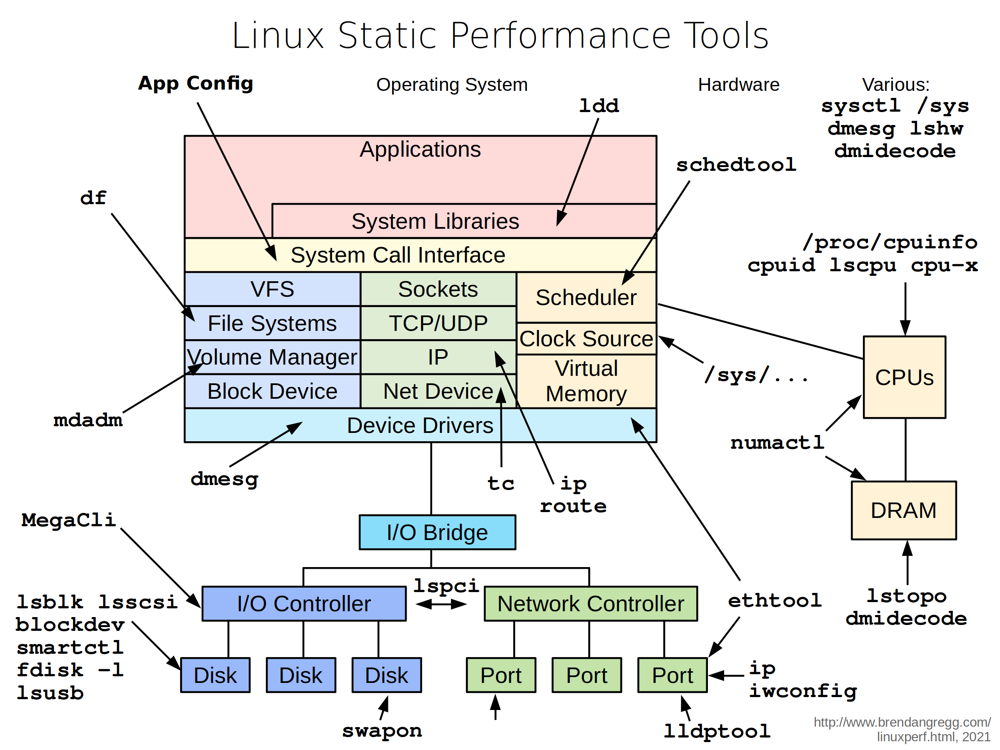
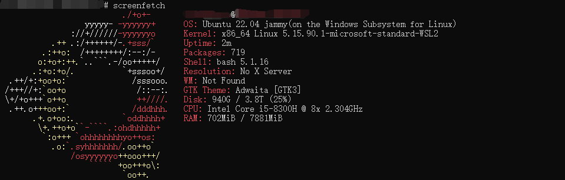

# 性能观测工具


Linux性能观测工具包：

| 软件包 | 性能工具列表 |
|:----:|:----:|
| `procps`(默认安装) | `ps(1)`、`vmstat(8)`、`uptime(1)`、`top(1)` |
| `util-linux`(默认安装) | `dmesg(1)`、`lsblk(1)`、`lscpu(1)` |
| `sysstat` | `iostat(1)`、`mpstat(1)`、`pidstat(1)`、`sar(1)` |
| `iproute2` | `ip(8)`、`ss(8)`、`nstat(8)`、`tc(8)` |
| `numactl` | `numstat(8)` |
| `linux-tools-common`、`linux-tools-$(uname -r)` | `perf(1)`、`turbostat(8)` |
| `bcc-tools (aka bpfcc-tools)` | `opensnoop(8)`、`execsnoop(8)`、`runqlat(8)`、`runqlen(8)`、`softtirqs(8)`、`hardirqs(8)`、`ext4slower(8)`、`ext4dist(8)`、`biotop(8)`、`biosnoop(8)`、`biolatency(8)`、`tcptop(8)`、`tcplife(8)`、`trace(8)`、`argdist(8)`、`funccount(8)`、`stackcount(8)`、`profile(8)` |
| `bpftrace` | `bpftrace`、basic versions of opensnoop(8)、`execsnoop(8)`、`runqlat(8)`、`runqlen(8)`、`biosnoop(8)`、`biolatency(8)` |
| `perf-tools-unstable` | Ftrace versions of opensnoop(8)、`execsnoop(8)`、`iolatency(8)`、`iosnoop(8)`、`bitesize(8)`、`funccount(8)`、`kprobe(8)` |
| `trace-cmd` | `trace-cmd(1)` |
| `nicstat` | `nicstat(1)` |
| `ethtool` | `ethtool(8)` |
| `tiptop` | `tiptop(1)` |
| `msr-tools` | `rdmsr(8)`、`wrmsr(8)` |
| [`brendangregg/msr-cloud-tools`](github.com/brendangregg/msr-cloud-tools) | `showboost(8)`、`cpuhot(8)`、`cputemp(8)` |
| [`brendangregg/pmc-cloud-tools`](github.com/brendangregg/pmc-cloud-tools) | `pmcarch(8)`、`cpucache(8)`、`icache(8)`、`tlbstat(8)`、`resstalls(8)` |

## 静态性能观测工具

静态性能观测工具检查的是系统在静止状态下的特性，而不是在主动工作负载下的特性。



# 性能监测工具

监测单个操作系统主机的传统工具是sar(System Activity Reporter)，即sar(1)，来自AT&T UNIX。<br>
sar(1)是基于计数器的，在预定的时间执行以记录系统级别计数器的状态。

网络监测的传统技术是简单网络管理协议(SNMP)。设备和操作系统可以支持SNMP，在某些情况下默认提供，避免了大量安装第三方代理或导出器的需要。SNMP包括许多基本的操作系统指标，尽管它还没有被扩展到涵盖现代应用。大多数环境已经改用基于自定义代理的监测来代替。

现代监测软件在每个系统上运行代理（导出器、插件），以记录内核和应用程序的指标。这些代理可以包括针对特定应用和目标的代理，例如MySQL数据库服务器、Apache网络服务器、Memcached缓存系统。这样的代理可以提供详细的应用请求指标，而这些指标是单独从系统计数器中无法获取的。

# 性能分析工具

性能分析工具在应用程序的每个线程上定期间隔地获取调用堆栈的快照（采样），然后通过网络通信将该数据传输到事件接收服务器进行分析，这种分析方法称为采样分析。Sentry工具的分析器每秒收集大约100次采样（每10毫秒一次）。与确定性分析相比，采样分析在数据准确性和运行时开销之间提供了合理的权衡，因为确定性分析通过跟踪每个函数调用引入了显着更高的开销。

对于大多数应用程序来说，在生产环境中启用分析的性能开销对终端用户来说是难以察觉的。分析的定量开销（以增加的CPU时间百分比衡量）取决于环境因素，例如SDK、平台、硬件以及工作负载是CPU密集型还是I/O密集型。Sentry采用的经验是，在每个平台上的典型配置中，引入大约1-5%的CPU时间开销用于性能采样分析。

# perf

perf最初是一个用于使用Linux中的性能计数器子系统的工具。目前已经进行了各种增强以增加跟踪功能。
- 性能计数器（Performance Counters）是CPU硬件寄存器，用于计算硬件事件，例如执行的指令数、缓存未命中次数或分支预测失败次数。它们为分析应用程序的性能提供了基础，可以追踪动态控制流并识别热点。perf提供了丰富的硬件特定功能的通用抽象。其中包括每个任务、每个CPU和每个工作负载的计数器，以及在其之上的采样和源代码事件注释。
- 跟踪点（Tracepoints）是放置在代码中逻辑位置的仪器化点，例如系统调用、TCP/IP事件、文件系统操作等。当不使用时，它们的开销几乎可以忽略不计，并且可以通过perf命令启用以收集包括时间戳和堆栈跟踪在内的信息。perf还可以使用kprobes和uprobes框架动态创建跟踪点，用于内核和用户空间的动态跟踪。

目前的perf是一个性能分析工具，用于在Linux系统上进行系统性能分析和调优。它可以帮助开发人员和系统管理员深入了解系统的性能瓶颈和应用程序的性能特征，并根据分析结果进行优化和调优。perf是一个强大的工具，被广泛用于开发、调试和优化各种类型的应用程序。

perf是Linux内核perf_events观测子系统的前端，perf_events也称为Linux性能计数器或Linux性能事件。

Linux[内核源码](https://github.com/torvalds/linux/tree/master/tools/perf)的`/tools/perf`目录下提供了perf工具。

perf工具可以提供多种性能分析功能，包括：
- CPU性能分析：可以使用perf来收集和分析CPU的使用情况，包括指令执行、缓存命中率、分支预测等信息，帮助发现CPU瓶颈和优化机会。
- 内存性能分析：可以使用perf来跟踪内存访问模式、内存分配和释放、页面错误等情况，以帮助识别内存相关的性能问题。
- I/O性能分析：perf可以用于分析磁盘、网络和其他I/O设备的使用情况，以了解I/O操作的性能瓶颈和优化空间。
- 系统调用分析：perf可以监视和分析应用程序的系统调用行为，包括调用次数、耗时等信息，帮助优化系统调用的性能。
- 火焰图生成：perf可以生成火焰图，用于可视化函数调用关系和函数执行时间，在性能分析中非常有用。

与其他跟踪器相比，perf(1)特别适合CPU分析：采样CPU栈踪迹，跟踪CPU调度器行为，检查PMC以了解微观架构级CPU性能，包括周期行为。

## perf命令格式


perf命令格式：
```shell
perf [--version] [--help] [OPTIONS] SUB_COMMAND [ARGS]
```

子命令：
- `annotate`：读取perf.data文件，并显示带注释的代码。
- `archive`：创建一个含有调试和符号信息的便携式perf.data文档。
- `bench`：用于系统基准测试套件的通用框架。
- `buildid-cache`：管理构建build-id缓存（USDT探测器使用）。
- `buildid-list`：列出perf.data文件中的build-id。
- `c2c`：缓存行分析工具。
- `config`：获取并设置配置文件中的变量。
- `daemon`：在后台运行记录会话。
- `data`：与数据文件相关的处理。
- `diff`：读取两个perf.data文件并显示差异。
- `evlist`：列出perf.data文件中的事件名称。
- `ftrace`：内核Ftrace功能的perf(1)接口。
- `inject`：用于增加事件流中的附加信息的过滤器。
- `iostat`：显示I/O性能指标。
- `kallsyms`：搜索运行中内核的符号。
- `kmem`：跟踪/度量内核内存(slab)属性。
- `kvm`：跟踪/测量KVM客户操作系统。
- `list`：列出所有符号事件类型。
- `lock`：分析锁事件。
- `mem`：分析内存访问。
- `record`：运行命令并将其配置文件记录到perf.data中。
- `report`：读取perf.data文件并显示配置文件。
- `sched`：跟踪/度量调度器属性。
- `script`：读取perf.data文件并显示跟踪输出。
- `stat`：运行命令并收集性能计数器统计信息。
- `test`：运行完整性测试。
- `timechart`：在施加负载时可视化整个系统的行为。
- `top`：带实时屏幕更新的系统性能分析工具。
- `trace`：一个实时跟踪器（默认跟踪系统调用）。
- `version`：显示perf二进制文件的版本。
- `probe`：定义新的动态跟踪点。

| perf命令 | perf命令说明 |
|:----:|:----:|
| `perf list` | 列出当前已知的所有事件。 |
| `perf list 'sched:*'` | 列出调度追踪点。 |
| `perf stat command` | 指定命令的CPU计数统计。 |
| `perf stat -d command` | 详细的CPU计数统计（包括额外信息），针对指定的命令。 |
| `perf stat -p <PID>` | 指定PID的CPU计数统计，直到按下Ctrl-C。 |
| `perf stat -a sleep 5` | 整个系统的CPU计数统计，持续5秒。 |
| `perf stat -e cycles,instructions,cache-references,cache-misses,bus-cycles -a sleep 10` | 各种基本的系统范围内的CPU统计信息，持续10秒。 |
| `perf stat -e L1-dcache-loads,L1-dcache-load-misses,L1-dcache-stores command` | 指定命令的各种CPU一级数据缓存统计。 |
| `perf stat -e dTLB-loads,dTLB-load-misses,dTLB-prefetch-misses command` | 指定命令的各种CPU数据TLB统计。 |
| `perf stat -e LLC-loads,LLC-load-misses,LLC-stores,LLC-prefetches command` | 指定命令的各种CPU最后一级缓存统计。 |
| `perf stat -e r003c -a sleep 5` | 使用原始PMC计数器，例如计算未停止的核心周期。 |
| `perf stat -e cycles -e cpu/event=0x0e,umask=0x01,inv,cmask=0x01/ -a sleep 5` | PMC计数器。通过原始规范计数周期和前端停顿。 |
| `perf stat -e raw_syscalls:sys_enter -I 1000 -a` | 每秒系统范围内的系统调用计数。 |
| `perf stat -e 'syscalls:sys_enter_*' -p <PID>` | 按类型计数指定PID的系统调用，直到按下Ctrl-C。 |
| `perf stat -e 'syscalls:sys_enter_*' -a sleep 5` | 按类型计数整个系统的系统调用，持续5秒。 |
| `perf stat -e 'sched:*' -p <PID>` | 按PID计数指定PID的调度事件，直到按下Ctrl-C。 |
| `perf stat -e 'sched:*' -p <PID> sleep 10` | 按PID计数指定PID的调度事件，持续10秒。 |
| `perf stat -e 'ext4:*' -a sleep 10` | 按事件统计整个系统的ext4事件，持续10秒。 |
| `perf stat -e 'block:*' -a sleep 10` | 按事件统计整个系统的块设备I/O事件，持续10秒。 |
| `perf stat -e 'vmscan:*' -a -I 1000` | 计数所有vmscan事件，每秒打印一次报告。 |
| `perf record -F 99 command` | 对指定命令进行99赫兹的CPU函数采样。 |
| `perf record -F 99 -p <PID>` | 对指定PID进行99赫兹的CPU函数采样，直到按下Ctrl-C。 |
| `perf record -F 99 -p <PID> sleep 10` | 对指定PID进行99赫兹的CPU函数采样，持续10秒。 |
| `perf record -F 99 -p <PID> -g -- sleep 10` | 对指定PID进行99赫兹的CPU堆栈跟踪采样，持续10秒（通过帧指针）。 |
| `perf record -F 99 -p <PID> --call-graph dwarf sleep 10` | 对PID进行CPU堆栈跟踪采样，使用dwarf（调试信息）展开堆栈，99赫兹，持续10秒。 |
| `perf record -F 99 -ag -- sleep 10` | 对整个系统进行99赫兹的CPU堆栈跟踪采样，持续10秒（< Linux 4.11）。 |
| `perf record -F 99 -g -- sleep 10` | 对整个系统进行99赫兹的CPU堆栈跟踪采样，持续10秒（>= Linux 4.11）。 |
| `perf record -F 99 -e cpu-clock -ag -- sleep 10` | 如果前面的命令不起作用，尝试强制perf使用cpu-clock事件。 |
| `perf record -F 99 -e cpu-clock --cgroup=docker/1d567f4393190204...etc... -a -- sleep 10` | 对通过/sys/fs/cgroup/perf_event cgroup标识的容器进行CPU堆栈跟踪采样。 |
| `perf record -F 99 -a --call-graph dwarf sleep 10` | 对整个系统进行99赫兹的CPU堆栈跟踪采样，使用dwarf堆栈，持续10秒。 |
| `perf record -F 99 -a --call-graph lbr sleep 10` | 对整个系统进行CPU堆栈跟踪采样，使用最后分支记录（LBR）堆栈，...（>= Linux 4.?）。 |
| `perf record -e L1-dcache-load-misses -c 10000 -ag -- sleep 5` | 对每10,000次一级数据缓存未命中进行CPU堆栈跟踪采样，持续5秒。 |
| `perf record -e LLC-load-misses -c 100 -ag -- sleep 5` | 对每100次最后级缓存未命中进行CPU堆栈跟踪采样，持续5秒。 |
| `perf record -e cycles:k -a -- sleep 5` | 对CPU进行5秒钟的在CPU上指令进行采样。 |
| `perf record -e cycles:u -a -- sleep 5` | 对CPU进行5秒钟的用户空间指令进行采样。 |
| `perf record -e cycles:up -a -- sleep 5` | 对CPU进行5秒钟的精确用户空间指令采样（使用PEBS）。 |
| `perf record -b -a sleep 1` | 执行分支跟踪（需要硬件支持），持续1秒。 |
| `perf top -F 49` | 以49赫兹对CPU进行采样，并实时显示顶部地址和符号（无perf.data文件）。 |
| `perf top -F 49 -ns comm,dso` | 以49赫兹对CPU进行采样，并实时显示顶部进程名称和段。 |
| `perf record -e sched:sched_process_exec -a` | 跟踪新的进程，直到按下Ctrl-C。 |
| `perf record -e context-switches -a` | 采样（获取一部分）上下文切换，直到按下Ctrl-C。 |
| `perf record -e context-switches -c 1 -a` | 跟踪所有的上下文切换，直到按下Ctrl-C。 |
| `perf record -vv -e context-switches -a` | 包括使用的原始设置（参见。 |man | `perf_event_open）。 |
| `perf record -e sched:sched_switch -a` | 通过调度追踪点跟踪所有的上下文切换，直到按下Ctrl-C。 |
| `perf record -e context-switches -ag` | 采样带有堆栈跟踪的上下文切换，直到按下Ctrl-C。 |
| `perf record -e context-switches -ag -- sleep 10` | 采样带有堆栈跟踪的上下文切换，持续10秒。 |
| `perf record -e context-switches -ag -T` | 采样上下文切换、堆栈跟踪和时间戳（< Linux 3.17，-T为默认）。 |
| `perf record -e migrations -a -- sleep 10` | 采样CPU迁移，持续10秒。 |
| `perf record -e syscalls:sys_enter_connect -ag` | 跟踪所有的connect()调用，并带有堆栈跟踪（出站连接），直到按下Ctrl-C。 |
| `perf record -e syscalls:sys_enter_accept* -ag` | 跟踪所有的accept()调用，并带有堆栈跟踪（入站连接），直到按下Ctrl-C。 |
| `perf record -e block:block_rq_insert -ag` | 跟踪所有的块设备（磁盘I/O）请求，并带有堆栈跟踪，直到按下Ctrl-C。 |
| `perf record -F 100 -e block:block_rq_insert -a` | 每秒最多采样100个块设备请求，直到按下Ctrl-C。 |
| `perf record -e block:block_rq_issue -e block:block_rq_complete -a` | 跟踪所有块设备的请求问题和完成（具有时间戳），直到按下Ctrl-C。 |
| `perf record -e block:block_rq_complete --filter 'nr_sector > 200'` | 跟踪所有块完成事件，大小至少为100KB，直到按下Ctrl-C。 |
| `perf record -e block:block_rq_complete --filter 'rwbs == "WS"'` | 跟踪所有块完成事件，仅同步写入，直到按下Ctrl-C。 |
| `perf record -e block:block_rq_complete --filter 'rwbs ~ "W"'` | 跟踪所有块完成事件，所有类型的写入，直到按下Ctrl-C。 |
| `perf record -e minor-faults -ag` | 采样次要故障（RSS增长），并带有堆栈跟踪，直到按下Ctrl-C。 |
| `perf record -e minor-faults -c 1 -ag` | 跟踪所有次要故障，并带有堆栈跟踪，直到按下Ctrl-C。 |
| `perf record -e page-faults -ag` | 采样页面故障，并带有堆栈跟踪，直到按下Ctrl-C。 |
| `perf record -e 'ext4:*' -o /tmp/| `perf.data -a` | 跟踪所有的ext4调用，并写入非ext4位置，直到按下Ctrl-C。 |
| `perf record -e vmscan:mm_vmscan_wakeup_kswapd -ag` | 跟踪kswapd唤醒事件，直到按下Ctrl-C。 |
| `perf buildid-cache --add which node` | 添加Node.js USDT探测点（Linux 4.10+）。 |
| `perf record -e sdt_node:http__server__request -a` | 跟踪node http__server__request USDT事件（Linux 4.10+）。 |
| `perf probe --add tcp_sendmsg` | 添加内核 tcp_sendmsg() 函数入口的跟踪点（"--add"是可选的）。 |
| `perf probe -d tcp_sendmsg` | 删除 tcp_sendmsg() 跟踪点（或使用 "--del"）。 |
| `perf probe 'tcp_sendmsg%return'` | 添加内核 tcp_sendmsg() 函数返回的跟踪点。 |
| `perf probe -V tcp_sendmsg` | 显示内核 tcp_sendmsg() 函数的可用变量（需要调试信息）。 |
| `perf probe -V tcp_sendmsg --externs` | 显示内核 tcp_sendmsg() 函数的可用变量，以及外部变量（需要调试信息）。 |
| `perf probe -L tcp_sendmsg` | 显示 tcp_sendmsg() 的可用行探测点（需要调试信息）。 |
| `perf probe -V tcp_sendmsg:81` | 显示 tcp_sendmsg() 在第81行的可用变量（需要调试信息）。 |
| `perf probe 'tcp_sendmsg %ax %dx %cx'` | 为 tcp_sendmsg() 添加一个跟踪点，使用三个入口参数寄存器（与平台相关）。 |
| `perf probe 'tcp_sendmsg bytes=%cx'` | 为 tcp_sendmsg() 添加一个跟踪点，使用别名（"bytes"）表示 %cx 寄存器（与平台相关）。 |
| `perf record -e probe:tcp_sendmsg --filter 'bytes > 100'` | 当 bytes（别名）变量大于100时，跟踪先前创建的跟踪点。 |
| `perf probe 'tcp_sendmsg%return $retval'` | 添加 tcp_sendmsg() 的返回跟踪点，并捕获返回值。 |
| `perf probe 'tcp_sendmsg size'` | 添加 tcp_sendmsg() 的跟踪点，并包含 "size" 入口参数（可靠，但需要调试信息）。 |
| `perf probe 'tcp_sendmsg size sk->__sk_common.skc_state'` | 添加 tcp_sendmsg() 的跟踪点，包括 size 和 socket 状态（需要调试信息）。 |
| `perf probe -nv 'tcp_sendmsg size sk->__sk_common.skc_state'` | 告诉我如何完成这个任务，但实际上不执行它（需要调试信息）。 |
| `perf record -e probe:tcp_sendmsg --filter 'size > 0 && skc_state != 1' -a` | 跟踪先前的跟踪点，当 size 不为零且状态不为 TCP_ESTABLISHED（1）时（需要调试信息）。 |
| `perf probe 'tcp_sendmsg:81 seglen'` | 为 tcp_sendmsg() 的第81行添加一个包含局部变量 seglen 的跟踪点（需要调试信息）。 |
| `perf probe 'do_sys_open filename:string'` | 为 do_sys_open() 添加一个带有文件名的字符串的跟踪点（需要调试信息）。 |
| `perf probe 'myfunc%return +0($retval):string'` | 为 myfunc() 的返回值添加一个字符串的跟踪点。 |
| `perf probe -x /lib64/libc.so.6 malloc` | 为 libc 中的用户级 malloc() 函数添加一个跟踪点。 |
| `perf probe -x /usr/lib64/libpthread-2.24.so %sdt_libpthread:mutex_entry` | 为此用户级静态跟踪点添加一个跟踪点（USDT，也称为 SDT 事件）。 |
| `perf probe -l` | 列出当前可用的动态跟踪点。 |
| `perf top -e raw_syscalls:sys_enter -ns comm` | 按进程跟踪系统调用，每2秒显示一次摘要。 |
| `stdbuf -oL perf top -e net:net_dev_xmit -ns comm | strings` | 按正在运行的进程跟踪发送的网络数据包，滚动输出（无清屏）。 |
| `perf record -F99 -e cpu-clock -e cs -a -g` | 以99赫兹采样堆栈，并跟踪上下文切换。 |
| `perf record -F99 -e cpu-clock/max-stack=2/ -e cs/max-stack=5/ -a -g` | 采样2层深度的堆栈，并将上下文切换堆栈采样到5层深度（需要4.8版本）。 |
| `perf c2c record -a -- sleep 10` | 记录高速缓存行事件（Linux 4.10+）。 |
| `perf c2c report` | 从先前的记录中报告高速缓存行事件（Linux 4.10+）。 |
| `perf report` | 如果可能，使用ncurses浏览器（TUI）显示perf.data。 |
| `perf report -n` | 显示包含样本计数的perf.data。 |
| `perf report --stdio` | 以文本报告形式显示perf.data，合并数据并显示百分比。 |
| `perf report --stdio -n -g folded` | 以折叠格式显示报告，每个堆栈占据一行（需要4.4版本）。 |
| `perf script` | 列出perf.data中的所有事件。 |
| `perf script --header` | 列出所有perf.data事件，并包含数据头（新版本内核；之前是默认设置）。 |
| `perf script -f time,event,trace` | 列出所有perf.data事件，并使用自定义字段（< Linux 4.1）。 |
| `perf script -F time,event,trace` | 列出所有perf.data事件，并使用自定义字段（>= Linux 4.1）。 |
| `perf script --header -F comm,pid,tid,cpu,time,event,ip,sym,dso` | 列出所有perf.data事件，并使用我推荐的字段（需要record -a；新版本内核）。 |
| `perf script -f comm,pid,tid,cpu,time,event,ip,sym,dso` | 列出所有perf.data事件，并使用我推荐的字段（需要record -a；旧版本内核）。 |
| `perf script -D` | 将perf.data的原始内容以十六进制形式转储（用于调试）。 |
| `perf annotate --stdio` | 反汇编并注释指令，并显示百分比（需要一些调试信息）。 |

## perf事件类型

常见的perf事件类型：
- 硬件事件：大多数处理器事件(PMC实现)。
- 软件事件：一个内核计数器事件。
- 硬件缓存事件：处理器缓存事件(PMC)。
- 内核PMU事件：性能监控单元(PMU)事件(PMC)。
- 缓存、浮点……：处理器厂商事件(PMC)和概要描述。
- 裸硬件事件描述符：通过裸代码表示的PMC。
- 硬件断点：处理器断点事件。
- tracepoint事件：内核静态检测事件。
- SDT事件：用户级静态检测事件(USDT)。
- pfm-events：libpfm事件。

## perf安装配置

安装perf(Ubuntu环境)：
```shell
sudo apt update
sudo apt upgrade
sudo apt-get install linux-tools-common linux-tools-generic linux-cloud-tools-generic linux-tools-`uname -r`
```

安装perf(WSL-Ubuntu环境)：
```shell
sudo apt update
sudo apt upgrade
sudo apt-get install linux-tools-common linux-tools-generic linux-cloud-tools-generic linux-tools-`uname -r`
sudo apt install build-essential flex bison libssl-dev libelf-dev
git clone --depth=1 https://github.com/microsoft/WSL2-Linux-Kernel.git
cd WSL2-Linux-Kernel/tools/perf
make
cp perf /usr/bin
```

查看perf版本：
```shell
perf version
```

# perf-map-agent

Linux性能工具期望在`/tmp/perf-<pid>.map`中提供未知内存区域中执行的代码的符号。这使得能够为动态生成代码的运行时环境提供动态符号映射，以供perf工具套件使用。

perf-map-agent一款[开源的](https://github.com/jvm-profiling-tools/perf-map-agent)、致力于为Java应用程序生成这样的映射文件的代理程序。perf-map-agent由一个用C编写的Java代理程序和一个小型的Java引导应用程序组成，该引导应用程序将代理程序附加到正在运行的Java进程上。

当perf-map-agent代理程序附加到Java进程上时，它从JVM获取JVM运行时生成的代码块，包括JIT编译的方法，还包括动态生成的基础设施部分，例如动态创建的解释器、适配器以及用于虚拟调度的跳转表。perf-map-agent代理程序创建了一个`/tmp/perf-<pid>.map`文件，每个代码块映射一个内存位置和一个代码块名称。

perf-map-agent的bin目录包含一组用于结合常见的perf/dtrace操作和创建映射文件的Shell脚本：
- `create-java-perf-map.sh <pid> <options*>`：接受一个PID和选项。它知道在bin目录相对于哪里找到库文件。
- `perf-java-top <pid> <perf-top-options>`：接受一个PID和其他要传递给`perf top`的选项。使用代理程序创建一个新的`/tmp/perf-<pid>.map`文件，然后使用给定的选项调用`perf top`。
- `perf-java-record-stack <pid> <perf-record-options>`：接受一个PID和其他要传递给`perf record`的选项。运行`perf record -g -p <pid> <perf-record-options>`来收集包括堆栈跟踪在内的性能数据。然后使用代理程序创建一个新的`/tmp/perf-<pid>.map`文件。
- `perf-java-report-stack <pid> <perf-record-options>`：首先调用perf-java-record-stack <pid> <perf-record-options>，然后运行`perf report`来直接分析捕获的数据。在脚本退出后，可以再次使用`perf report -i /tmp/perf-<pid>.data`以及任何选项来进一步分析之前运行的数据。
- `perf-java-flames <pid> <perf-record-options>`：使用`perf-java-record-stack`收集数据，然后使用brendangregg的FlameGraph工具创建可视化效果。要获得跨多个JIT编译方法的有意义的堆栈跟踪，需要使用`-XX:+PreserveFramePointer`（从JDK8-update-60-build-19开始可用）。
- `create-links-in <targetdir>`：将符号链接安装到上述脚本中的<targetdir>目录中。
- `dtrace-java-record-stack <pid>`：接受一个PID。运行dtrace来收集包括堆栈跟踪在内的性能数据。然后使用代理程序创建一个新的/tmp/perf-<pid>.map文件。
- `dtrace-java-flames <pid>`：使用dtrace-java-record-stack收集数据，然后使用@brendangregg的FlameGraph工具创建可视化效果。要获得跨多个JIT编译方法的有意义的堆栈跟踪，需要使用-XX:+PreserveFramePointer（从JDK8更新60构建19开始可用），如ag netflix博客文章中所述。

## perf分析全局性能

监测全局性能(输入`Ctrl+C`终止监测，输出数据是`perf.data`)：
```shell
perf record -g
```

查看perf记录：
```shell
perf report
```

将perf数据转化为txt格式：
```shell
perf script > perf.data.txt
```

根据`perf.data.txt`生成火焰图：
```shell
./FlameGraph/stackcollapse-perf.pl perf.data.txt | ./FlameGraph/flamegraph.pl > flamegraph.svg
```

也可以这样做：
```shell
perf record -F 99 -a -g -- sleep 60
perf script -i perf.data | ./FlameGraph/stackcollapse-perf.pl | ./FlameGraph/flamegraph.pl > flamegraph.svg
```

## perf分析SPECjvm2008性能

测试环境：
- Machine's Architecture : x86_64
- Operating System : GNU/Linux
- OS Kernel Release Number : 5.15.90.1-microsoft-standard-WSL2
- OS Kernel Version : #1 SMP Fri Jan 27 02:56:13 UTC 2023
- CPU Model : Intel(R) Core(TM) i5-8300H CPU @ 2.30GHz
- CPU Cores : 4
- Main Memory Size : 7.7GB
- Graphics Card Version : GeForce GTX 1050 Ti
- JDK Version : jdk-8u371-linux-x64
- JRE Version : 1.8.0_371-b11



编写[`wait_until_run_perf.sh`](../blob/master/src/wait_until_run_perf.sh)脚本实现以下任务目标：在忙等待的状态下获取特定命令的进程pid，并在进程执行期间使用perf命令对该进程进行监测，最后在进程执行结束后结束程序。

启动compress基准测试：
```shell
java -Djava.awt.headless=true -jar SPECjvm2008.jar -i console -ikv compress
```

监测指定进程的性能(输入`Ctrl+C`终止监测，输出数据是`perf.data`)：
```shell
perf record -p <pid> -g
```

将perf数据转化为txt格式：
```shell
perf script > perf.data.txt
```

根据`perf.data.txt`生成火焰图：
```shell
./FlameGraph/stackcollapse-perf.pl perf.data.txt | ./FlameGraph/flamegraph.pl > flamegraph-compress.svg
```

火焰图效果展示：<br>


编写脚本[run_perf_with_map.sh](../blob/master/src/run_perf_with_map.sh)用perf-map-agent直接生成火焰图，将其放置于SPECjvm2008根路径下，将安装时的`<target_dir>`设置为SPECjvm2008根路径，然后：
```shell
chmod +x ./run_perf_with_map.sh
./run_perf_with_map.sh
```

火焰图效果展示：<br>


编写脚本[run_perf_map_agent.sh](../blob/master/src/run_perf_map_agent.sh)，在忙等待的状态下获取特定命令的进程pid，并在进程执行期间使用perf-map-agent对该进程进行监测，在进程执行结束后生成火焰图。将脚本放置于SPECjvm2008根路径下，将安装时的`<target_dir>`设置为SPECjvm2008根路径，然后：
```shell
chmod +x ./run_perf_map_agent.sh
./run_perf_map_agent.sh
```

火焰图效果展示：<br>


## perf-map-agent安装配置

下载[perf-map-agent](https://github.com/jvm-profiling-tools/perf-map-agent)源码：
```shell
git clone "https://github.com/jvm-profiling-tools/perf-map-agent"
```

编译与链接：
```shell
sudo apt install cmake
cd perf-map-agent
cmake .
make
./bin/create-links-in <target_dir>
```
